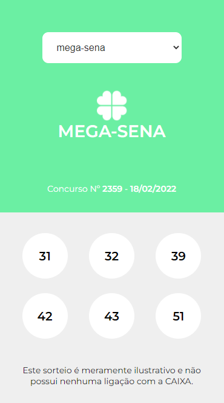

# Brainnco Front-end challenge

Uma **aplicação web front-end** que mostra **Resultados das loterias**.

Site: 

#### Desktop:


#### Desktop:




---
## Tecnologias e ferramentas

- NextJs
- Typescript
- React-testing-library
- Styled-components
- Styled-media-query
- Eslint
- Prettier
- Husky
- Lint-staged


### Como rodar o projeto

Para rodar o projeto clone esse repositório no seu terminal e entre no diretório do projeto, após isso instale todas as dependencias necessárias com o comando abaixo:

```
npm install
```
ou
```
yarn
```

Após a instalação das dependencias rode o projeto com o comando abaixo:

```
npm run dev
```
ou
```
yarn dev
```

Então digite a seguinte URL no seu navegador:

```
http://localhost:3000
```

---

Feito por Andre Luis Santolin
